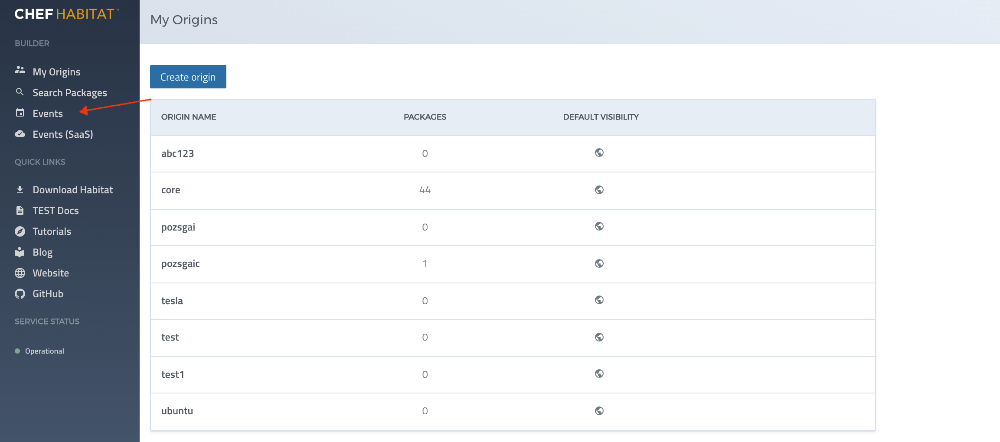
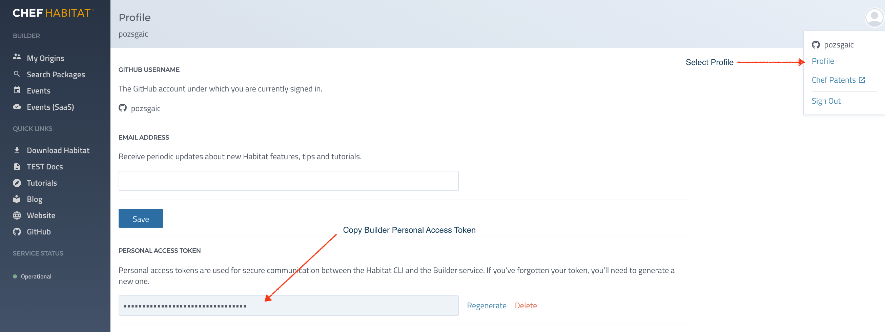
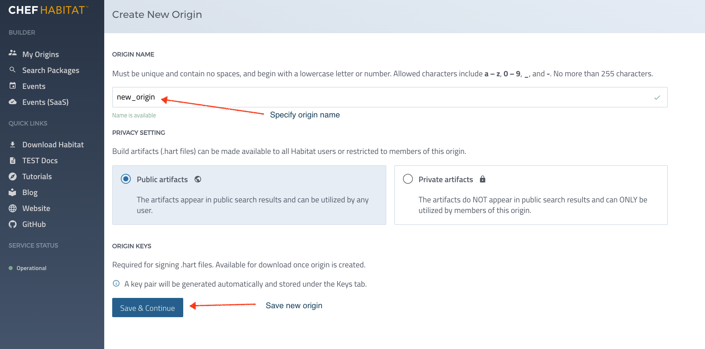
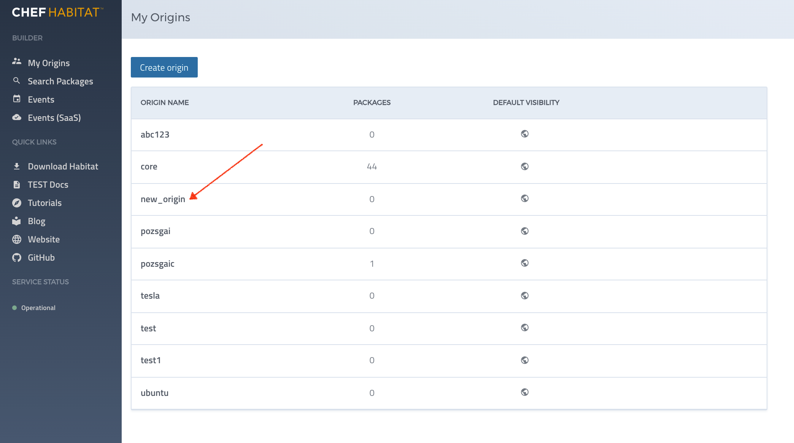

# Table of Contents
1.  [Introduction](#intro)
2.  [Building Builder](#building-builder)
3.  [Running Cargo Tests](#cargo-tests)
4.  [Running Builder](#running-builder)
5.  [Checking Database](#check-database)
6.  [Builder UI](#builder-ui)
7.  [Commonly Encountered Errors](#common-errors)
8.  [Developer Tips](#dev-tips)

## 
##Habitat Builder Dev Handbook

This handbook will facilitate a better developer debugging experience with
the Habitat Builder.  This document will go from start to finish in the
standalone dev environment to demonstrate some basic functions required to understand and navigate the Builder environment on the front end as well as the back end.  

This document will include general instructions along with a number of repeatable commands or UI actions to ensure your environment is set up correctly.  It will also include troubleshooting information that can be useful in solving common configuration problems.

Also, this document will include a section that can help shorten your
development time.  Some tips on getting around build errors, what you
can and can't do if your internet is down, etc. are included.

## 
##Building Builder

Habitat Builder services run inside the hab studio and are mostly Rust services.
These service are typically built in Linux (18.04) VMs.  The Builder UI runs on the workstation (MacOS) and connects to the Builder services through the builder-api-proxy.  The Builder UI is compiled at launch time and runs in the JavaScript node runtime.  
   
This section discusses mainly how to build the Rust based services, but does minimally discuss Builder UI building.  

### Linux Environment
When building builder, each builder service is built separately.
Typically, you'll want to clone the repo https://github.com/habitat-sh/builder.git on both the Mac host and on the VM you plan to use for the backend.  This will enable you to run
Linux builds inside the VM and run the Builder UI from the front-end 

### MacOS Environment
For the front-ends, kicking off a build is as easy as typing `npm start` from the components/builder-web directory.  Implicit in the this run command is the dependency on the building of any changes, similar to make dependencies.

### DNS Issues
If having trouble cloning the repo from within the VM, the DNS is likely not configured correctly.  If DNS is a lingering issue, and you have tried the troubleshooting provided at multipass website (https://multipass.run/docs/troubleshooting-networking-on-macos) and from our [troubleshooting section](#common-errors), you can still mount your Mac directory in your VM and copy the code from that mount point to a local directory.  

#### Multipass Directory Mounting
If using multipass, you specify the mount point on creation.  Find the mount point using the multipass info command for the VM named `automate`:

`$multipass info automate`

Mounts:  /Users/morrisonj/Development/Chef/automate => /mnt/Chef/automate

You would clone your code locally at /Users/morrisonj/Development/Chef/automate and can access those files on your multipass VM:

`$multipass shell automate`  to enter VM

`$ls -l /mnt/Chef/automate`  to view mounted files

Each buildable component can be identified knowing that each buildable component must have a plan.sh file.  Run the following to see which builder components can be built:

`$  find components -name plan.sh`

You will see a large number of plan files, some of which are test plans.  We will focus on building the builder-api component at the moment.

Note that there are two types of builds that can be performed:  inside the hab studio and outside the hab studio.  

### Build Technique 1:  Full hab package build and install

To build a new package, you would run from your builder root directory:

$  `export HAB_ORIGIN=habitat`

$  `hab pkg build components/$COMPONENT`

When you run this command, a Habitat studio is created behind the scenes and is used to build the package.  The studio build takes a long time and is needed mainly to set up the studio and install required packages for building and running the builder services.  Successfully built packages can be found in the results subdirectory and have .hart file extensions.  The results subdirectory can be accessed from within the studio or from outside the studio.

The directory from which you issue the `hab pkg build` will be mounted as the /src directory of your hab studio.  You can see your hab studios via:
`ls -l /hab/studios`

If you started your build from /home/ubuntu/builder, then the studio will be located at `hab/studios/home--ubuntu--builder/`.

The build results are located in the `results` subdirectory.  In this directory, the newly created package (hart file) can be located.  

`ls -l results/*.hart`

`-rw-r--r-- 1 ubuntu ubuntu 52099520 Dec 15 18:41 results/habitat-builder-api-9978-20211215222751-x86_64-linux.hart`

### Package Installation

To install the package you've built, locate the hart file that was generated from the previous `hab pkg build` and run the following:

$ `hab pkg install results/$origin-$component-$version-$release-$target.hart`

   where:
    
    origin    = habitat
    
    component = builder-api
    
    version   = 4 digit number (for builder components)
    
    release = YYYYmmddHHHHMMSS format
    
    target    = x86_64-linux

This will install your package to `/hab/pkgs/$origin/$component/$version/$release` directory.  In our example for builder-api, we can find our installation in the following directory in the studio:

`/hab/pkgs/habitat/builder-api/9978/20211215222751`

For the Rust services, we can expect to see the following in each release directory:
1. A bin subdirectory containing the executable 
2. A config subdirectory containing the service configuration.  
3. A default.toml file containing the default configuration values.

Drill down into the bin subdirectory to find the executable in the bin directory.  Remember this location as this bin directory is where we can change our code to update our bldr-api executable and overwrite it.

### Build Technique 2:  Cargo component build 

Once you have completed a component build inside the studio, you can update that component from a local build and deploy those changes in the studio.  The local build should be much faster as we are only building one rust component.  The `hab pkg build` performs a large number of copies and downloads to prepare the studio and should be avoided once it completed successfully.

The simplest way to get started is to build our builder-api component, generate the executable, and deploy to the `/hab/pkgs` directory we created when we performed the initial `hab pkg build`.  

To build component builder-api, run the following from the root of the builder directory:

$ `sudo ./build.sh components/builder-api` _OR_

$ `sudo make build-builder-api`

These scripts handle setting up the build and linker environment variables to simplify the builder build process.  It is not recommended to try to run cargo builds from the command line due to the complex environment settings, although it is possible. 

When the cargo build completes, it will create a target/debug directory that contains the Rust executable.  For example, building `builder-api` would create something similar to the following:

$ `ls -l target/debug`

**-rwxr-xr-x   2 root root 367909632 Dec 29 10:03 bldr-api**

To update the bldr-api executable, the release directory for the builder-api must be located in the studio:

$ `hab studio enter`

`#` `ls -lrt /hab/pkgs/habitat/builder-api`

**drwxr-xr-x 4 root root 4096 Jan 12 11:55 9978**

If there are multiple directories, choose the version with the highest value as that is the latest one.

`#` `cd 9978`

`#` `ls -l`

**drwxr-xr-x 5 root root 4096 Jan 12 11:55 20211221122808**

`#` `cd 20211221122808`

The executable can be overwritten by copying the bldr-api executable over top of the file located in the `bin` subdirectory.  You should stop the builder before copying the executable, then start it afterward:

`#``stop-builder`

`#``cp target/debug/bldr-api /hab/pkgs/habitat/builder-api/9978/20211221122808/bin`

`#` `start-builder`

## 
## Running Cargo Tests

It is possible to run your test cases with the `test/run_cargo_test.sh` script.
This script requires your component name as an input and will set the environment and run "cargo test", printing the results to console.

## 
## Running Builder Services

Running Builder in the standalone dev environment requires that the main host will run Builder UI from localhost, while the backend services will run on virtual hosts.  

To begin working with the backend services, first log into the virtual host and go to the root of the builder directory you are assumed to have set up with your github and builder credentials.  Enter the studio:
$ hab studio enter

The first time may take a little while to load but will map your current directory to /src in the studio.
Note that the prompt changes to #.

Start up the builder:

`#` `start-builder`

You should see output similar to that shown below:

_Starting datastore_

_The habitat/builder-datastore service was successfully loaded_

_The core/sccache service was successfully loaded_

_The habitat/builder-memcached service was successfully loaded_

_The habitat/builder-api service was successfully loaded_

_The habitat/builder-api-proxy service was successfully loaded_

_The habitat/builder-jobsrv service was successfully loaded_

_The habitat/builder-worker service was successfully loaded_

_The habitat/builder-minio service was successfully loaded_

_Builder Started: Navigate to http://localhost/#/pkgs/core to access the web UI._

_Minio login available at http://localhost:9000_

_Username: *******_

_Password: *******_

Check your builder services status:

`#` `hab svc status`

| package                                       | type       | desired | state | elapsed | pid  | group                     |
|-----------------------------------------------|------------|---------|-------|---------|------|---------------------------|
| habitat/builder-api-proxy/9376/20211207194443 | standalone | up      | up    | 7175    | 2141 | builder-api-proxy.default |
| habitat/builder-minio/7764/20181006010221     | standalone | up      | up    | 7175    | 2148 | builder-minio.default     |
| habitat/builder-worker/9956/20211101185416    | standalone | up      | up    | 7175    | 2163 | builder-worker.default    |
| habitat/builder-api/9978/20211221122808       | standalone | up      | up    | 7175    | 2171 | builder-api.default       |
| habitat/builder-jobsrv/9982/20211222144544    | standalone | up      | up    | 7175    | 2203 | builder-jobsrv.default    |

You can run stop-builder to stop all builder services or use `hab svc stop <group>` to stop
an individual service.  It is good practice to check the outcome of your commands with `hab svc status`.

###  Load a Test Service by its Origin and Package name

From our search of sample plan.sh files, we did not find much of interest.  So we cloned the habitat repo and found a large number of services.  We picked this one:
`./test/fixtures/plans/simple-hooks/plan.sh`

To know which origin to load we peek at the plan.sh file:

`pkg_name="nats-event-stream-test"`

`pkg_origin="habitat-testing"`

`#` `hab svc load habitat-testing/simple-hooks`

You should see the following output:

_The habitat-testing/nats-event-stream-test service was successfully loaded_

Note that you can load your own service or any arbitrary service that can be found in the Builder UI search packages feature.  

To verify that your service is running, run:

`hab svc status | grep habitat-testing`

With expected result similar to the following:
`habitat-testing/nats-event-stream-test/2.1.2/20200106182207  standalone  up       up     311          11827   nats-event-stream-test.default`

To stop the service, run:

`#` `hab svc stop habitat-testing/nats-event-stream-test`

## 
## Checking the Database:

In the Builder UI, when we create an origin or other construct, it will be persisted in a Postgresql database that can be accessed from within the studio.  The builder services must be running, specifically the habitat/builder-api service and the habitat/builder-datastore service.  To open the database, we first look up the database config information:

`#` `cat /hab/svc/builder-api/config/config.toml` OR

From outside of the studio on VM host Linux terminal:

`$` `curl -s http://localhost:9631/services/builder-api/default | jq -r .cfg`

You will see a section [datastore], and the metadata for the database are defined in that section.  Of most importance is the password.  Copy into the clipboard or set as environment variable $PGPASSWORD

Log into the database:

`#` `psql -d builder -U hab -W`

_Password for user hab:_
$PGPASSWORD

_psql (9.6.21, server 9.6.9)_

_Type "help" for help._

builder=# 

At the prompt, use psql command `\dt` to view the database table and contents:

* View the builder database tables (some tables omitted)
_$builder=# \dt_

                    
 Schema |              Name              | Type  | Owner 
--------+--------------------------------+-------+-------
 public | account_tokens                 | table | hab
 public | accounts                       | table | hab
 public | groups                         | table | hab
 public | job_graph                      | table | hab
 public | jobs                           | table | hab
 public | origin\_channel\_packages        | table | hab
 public | origin_channels                | table | hab
 public | origin_integrations            | table | hab
 public | origin_invitations             | table | hab
 public | origin_members                 | table | hab
 public | origin\_package\_settings        | table | hab
 public | origin_packages                | table | hab
 public | origin\_private\_encryption\_keys | table | hab
 public | origin\_project\_integrations    | table | hab
 public | origin_projects                | table | hab
 public | origin\_public\_encryption_keys  | table | hab
 public | origin\_public\_keys             | table | hab
 public | origin\_secret\_keys             | table | hab
 public | origin_secrets                 | table | hab
 public | origins                        | table | hab

* View the origin data:

`$ builder=#` `select * from origins;`

(Don't forget the ";" after the select command!)

  name  |      owner_id       |          created_at           |          updated_at           | default\_package\_visibility 
--------+---------------------+-------------------------------+-------------------------------+----------------------------
 core   | 1938518492877692928 | 2021-12-28 20:19:01.374393+00 | 2021-12-28 20:19:01.374393+00 | public
 ubuntu | 1938518492877692928 | 2021-12-28 20:19:39.710184+00 | 2021-12-28 20:19:39.710184+00 | public
(2 rows)

* Complex queries:

As postgresql supports standard SQL, it is possible to execute complex queries at the pqsl command line.  If, for example, we wanted to join the origin_channels and origins tables based on the origin, we could issue the following:

`select distinct o.name from origin_channels oc inner join origins o on oc.origin = o.name;`

And yield similar results to the following:

_name_   

_----------_

_core_

_test_

_ubuntu_

_(3 rows)_

## 
## Starting Builder UI

Go to the components/builder-web directory on your workstation (not in the VM) and launch the UI via:

`$` `npm start`

You should see the connection URLs and once completed it will display:

[Browsersync] Reloading Browsers...

Open your browser to http://localhost:3000 and you will be prompted to sign in to your github account.  If successful, you can begin to use builder.  

On the console screen, you will see trace for each UI action.  For example:

`[HPM] GET /v1/user/origins -> http://automate:9636`

will display if you click on the Origins feature in the Builder UI.  This will load the existing origins from the local database and display them.  If you are not connected to the builder backend, you will not see the above trace.  See below for resolving some commonly encountered errors for Builder startup.

If there are no errors and you do not see origins, you can create one using the Builder UI or from the command line inside the studio:

`#` `origin test`

### Enabling/Disabling UI Features
In the components/builder-web directory you will find the main configuration file _habitat.conf.js_ that controls the builder-api-proxy configuration settings, and these include settings affecting the UI display.  It is possible to change this file and restart the Builder UI to update the UI itself or some underlying configuration of the builder-api-proxy.

#### Working Example:  Viewing Builder Events
In the main configuration file, there should be a line containing the setting for enabling builder events:

`enable_builder_events: false,`

To enable viewing the builder events on the UI, set this value to true, save the file, and restart the Builder UI (npm start).  You should see the _Events_ feature is enabled as shown below:

## 
## Commonly Encountered Errors:

### DNS Errors:

If you cannot reach the internet from your VMs, you will not be able to clone from github, reach github for Builder UI login, or pull down dependencies when trying to build.  Assuming you have followed the instructions from the multipass troubleshooting and you still have connectivity issues, you may try the following:

* Login to your MacOS workstation and DO NOT connect to the VPN.  If you have already opened your VPN and closed it, then do the following:
	* 	Close down all of your multipass instances.  Use multipass list to display your VMs and shut down with `multipass stop <VM>`.  Note that sometimes the instances may have not started up and are stuck in the `Starting` state.  You want to shut these down too as there is a flag set even though the console shows them as Starting.  
	*  Under MacOS `System Preferences`, disable the Internet Sharing feature.  Errors starting the VMs occur when this setting is enabled, despite what is mentioned in multipass online troubleshooting.
	*  Reboot the workstation
	*  Type `multipass list` and ensure all VMs are `Stopped`
	*  Start any of your VMs and enter that VM with `multipass shell <VM>`
	*  Add `nameserver 1.1.1.1` to top of the /etc/resolve.conf file using sudo.
	*  Try to ping google.com and github.com.  If these work, then DNS has been configured for your VM.  Perform same steps for each VM you need to set up for DNS.

	
### Build failures:

In the event of a build failure, first eliminate any recent code changes.  If that does not fix the problem, we should clean our build dependencies and try again.  

Use the Makefile `clean` target that can be used as follows (from builder root directory) as follows:

`sudo make clean`

This will remove all content in target/debug directory and force a full rebuild of build target $target.

`sudo make builder-$target`

### Front End:

To run the Builder UI, run:

`$ npm start` 

from the components/builder-web subdirectory ensuring that these configuration files have been set up:

-  habitat-env
-  components/builder-web/bs-config.js

#### Cannot Sign In to Github

Open the browser on local Mac to http://localhost:3000 to access the builder.  It is necessary to `Sign In` to your github account.  If login to your account fails, then the habitat-env may not correct for your github configuration.  Refer to the builder UI readme at https://github.com/habitat-sh/builder/blob/main/components/builder-web/README.md for more information. 

If you have followed these steps and still cannot sign in to github, then there is likely a DNS issue that is not preventing your Builder service from reaching github.com.  Ensure your DNS is working by trying to ping github.com from your VM command line.  Once you can ping github from the command line, restart the builder services and try again.

#### Builder UI - ECONNECTREFUSED

If you run `npm start` and see console errors with message ECONNECTREFUSED, then the settings in config file `bs-config.js` may not be correct.  Ensure that the target field points to port 9636 on your Builder virtual host:

E.G.  target: 'http://<VM Host IP Address>:9636'

If it still cannot connect, ensure that your Builder backend services are up, and that port forwarding has been set up for port 9636.  See instructions here: https://github.com/habitat-sh/builder/blob/main/DEVELOPING.md.

### Back End:

#####  [401 Unauthorized]

- Scenario:  Inside of the hab studio (hab studio enter), user enters a command to hab and receives this error.

- Example:   `load_package /hab/cache/artifacts/core-hab-backline-1.6.420-20211101174345-x86_64-linux.hart`

`Error Message: [401 Unauthorized] Please check that you have specified a valid Personal Access Token.`  

- Solution:
`export HAB_AUTH_TOKEN=<YOUR BUILDER UI DEV TOKEN>`

Refer to the DEVELOPING.md readme file for setting up the Personal Access Token and export the value in environment variable $HAB\_AUTH\_TOKEN.  You will need one token from the Live Builder UI and one from the local Builder UI instance.  To run from the UI, the live token should be set as HAB\_AUTH\_TOKEN at startup of the services.  The image below shows the Builder screen where you can generate your token:

 

But to run CLI commands from within the studio (such as load\_package), export the local Builder UI token as HAB\_AUTH\_TOKEN at the command line after starting the services.   

#####  [ 403 Forbidden ]

If the keys for the origin are not loaded, it can cause this error.  To solve, ensure HAB\_AUTH\_TOKEN is set to the DEV instance and run the following from the studio command line:

`#origin your_origin`

The results of a successful origin creation command are as follows:

`[default:/src:0]# origin test1`

`Generating origin key for test1`

`★ Generated origin key pair test1-20220125193359.`
`» Uploading latest public origin key test1`
`↑ Uploading /hab/cache/keys/test1-20220125193359.pub`
`✓ Uploaded test1-20220125193359`
`★ Upload of public origin key test1-20220125193359 complete.`
`↑ Uploading /hab/cache/keys/test1-20220125193359.sig.key`
`✗✗✗`
`✗✗✗ [201 Created]`
`✗✗✗`

##### Crypto error:  No revisions found for core

This error is often encountered when switching between sudo and non-sudo hab cli calls.  When running hab as sudo, keys will be generated in /hab/cache/ssl, and ~/.hab/cache/ssl for non-sudo hab cli calls.  The simplest workaround is to copy the keys from the ~/.hab/cache/ssl to /hab/cache/ssl if a sudo hab cli call failed, and vice versa for a non-sudo hab cli call.

`$ sudo cp ~/.hab/cache/ssl/<missing key> /hab/cache/ssl`  OR for non-sudo

`$ cp /hab/cache/ssl/<missing key> ~/.hab/cache/ssl`

##### Origin was created successfully but is not displayed on local Builder UI
When creating an origin with the hab cli, it will by default be created in the public (live)  Builder.  You should use the -u flag to specify the local URL and -z to specify your Builder access token.  If you create an origin from a local Builder UI, then it will be added to your local environment.  If you do not use these options, the origin will be created in the public Builder.

See `hab origin create -h` for more info.

## 
## Other Tips:

### Minimize use of "hab pkg build":

For a new development session, you will generally want to run hab pkg build on your project to create a new studio.   This is a time-consuming process but it does a few important things:

   - deletes and creates the studio in /hab/studios that maps to the root directory of your project
         e.g.:  ~/builder  --> /hab/studios/home--ubuntu--builder
   - automatically downloads packages to achieve a successful build in the studio (requires internet)

Once you've run this command, your studio should be set up and you can then perform cargo builds.

### Adding trace to a builder service Rust file
 
   -  Perform hab pkg build on builder-api
   -  Perform hab pkg install on builder-api (export HAB_ORIGIN=habitat)
   -  Note the highest version number by inspection of /hab/pkgs/habitat/builder-api/
   -  Add a println trace to mod.rs in the run function in builder-api service and rebuild builder-api with `sudo make builder-builder-api.
   -  Locate the executable:  ls -l target/debug/bldr-api   
   -  hab studio enter
   -  stop-builder
   -  Copy the executable to the bin directory:  cp target/debug/bldr-api /hab/pkgs/habitat/builder-api/$highest_version/YYYYMMDDHHMMSS/bin
   -  start-builder
   -  See if your code path is hit:  grep <MY_TRACE> /hab/sup/default/sup.log

When you run "hab studio enter", the hab supervisor directs the download of
the latest packages and will start all of the builder services when invoking "start-builder".

Run `hab svc status` to see which services are running.  Expect to see similar
output to the following:

Note after the builder-* services there is an identifier followed by a timestamp.  If, for example, you are working on builder-api then you are running version 9978.  

When you run `hab pkg build builder-api` you will see the package that gets created has a higher version than 9978.  You will want to install this package once built:

`hab pkg install results/habitat-builder-api-9982-20211229220335.hart`

If you stop the builder, and re-start it, you should observe the version 9982 when running `hab svc status`.  If that does not work, remove the old builder-api installation using "rm -f /hab/pkgs/habitat/builder-api/9978".

The system will find the latest version is the only version and it should then load.  

### Running Curl to Perform Web Requests

This section contains a number of web requests that are useful when running Builder and Habitat Supervisor.  The web api documentation for habitat are defined at [https://docs.chef.io/habitat/supervisor_api/](https://docs.chef.io/habitat/builder_api/) and for builder at [https://docs.chef.io/habitat/builder_api/](https://docs.chef.io/habitat/builder_api/).  The web requests can be constructed using the base URI and the paths for each specific web request.  Below are the base URIs to access these services from your workstation or from within your virtual host:

| Service    | BaseURI                                    |
|------------|--------------------------------------------|
| builder    |http://localhost:9636 (from virtual host)   |
| builder    |http://`<VM IP>`:3000 (from workstation).   |
| supervisor |http://localhost:9631 (from virtual host)   |
| supervisor |http://`<VM IP>`:9631 (from workstation)    |

Note that the BaseURI can be swapped out for the BaseURI for the live environment  to run the same web request in that environment.

#### Install jq on Linux VM
It is an important debugging tool to run curl/jq commands and is a pre-requisite for this section.  Install jq on the Linux VM with:

`sudo apt-get install jq`

A few examples will be provided to show how we can use curl to interact with our web services.  Each command starts with the base URI and adds the path/route to achieve the specific functionality.  

#### Show Service Configuration information
The example below will display json object for the builder-api configuration

`curl -s http://localhost:9631/services/builder-api/default | jq -r . | more`

In the above, we would need to be on the virtual host for this to succeed.  When viewing the output from the above command, we see that there is an object named "cfg".  We can extract
the cfg data by piping output into jq:

`curl -s http://localhost:9631/services/builder-api/default | jq -r . | jq .cfg`

Further, if we only want to see the builder-api github config data we could run:

`curl -s http://localhost:9631/services/builder-api/default | jq -r . | jq .cfg.github`

#### Show builder events
A relatively new feature that allows us to view builder events with a date filter:

`curl -v -X GET "http://automate:9636/v1/depot/events?range=0&channel=stable&from_date=2021-10-11&to_date=2022-01-11&query=" | jq . | more`

The path is v1/depot/events with a set of required input parameters.  

### Builder UI Actions
 
This section assumes that there is a host running the Builder UI via "npm start" command in the components/builder-web directory.  To get started, open browser to http://localhost:3001 and observe the output on the Builder UI terminal console.  You should see something similar to:

`[Browsersync] Access URLs:`

`[2]    ---------------------------------------------`
`[2]         Local: http://localhost:3001/#/pkgs/core`
`[2]     External: http://10.0.0.158:3001/#/pkgs/core`

#### Create an origin

Create a new origin, for example "new_origin" using the Builder UI.  

You should see this new origin on the Builder UI and also see the traffic in your Builder UI console:

`[2] [HPM] POST /v1/depot/origins -> http://automate:9636`
`[2] [HPM] POST /v1/depot/origins/new_origin/keys -> http://automate:9636`

The following curl command can be used to see the origin you created from your workstation, noting that $ip_address is your VM IP address.

`http://$ip_address:9636/v1/depot/origins/new_origin`

You can also create an origin from the hab cli from inside the studio:
`# hab origin create -u http://localhost:9636 -z $DEV_BUILDER_TOKEN  new_origin2`

If you have a valid token generated from your dev Builder UI instance set in $DEV_BUILDER_TOKEN, this will produce the following output in the studio:

`Ω Creating origin new_origin2.`

`✓ Created origin new_origin2.`

Refresh the Builder UI and the origin should be displayed there as well.

