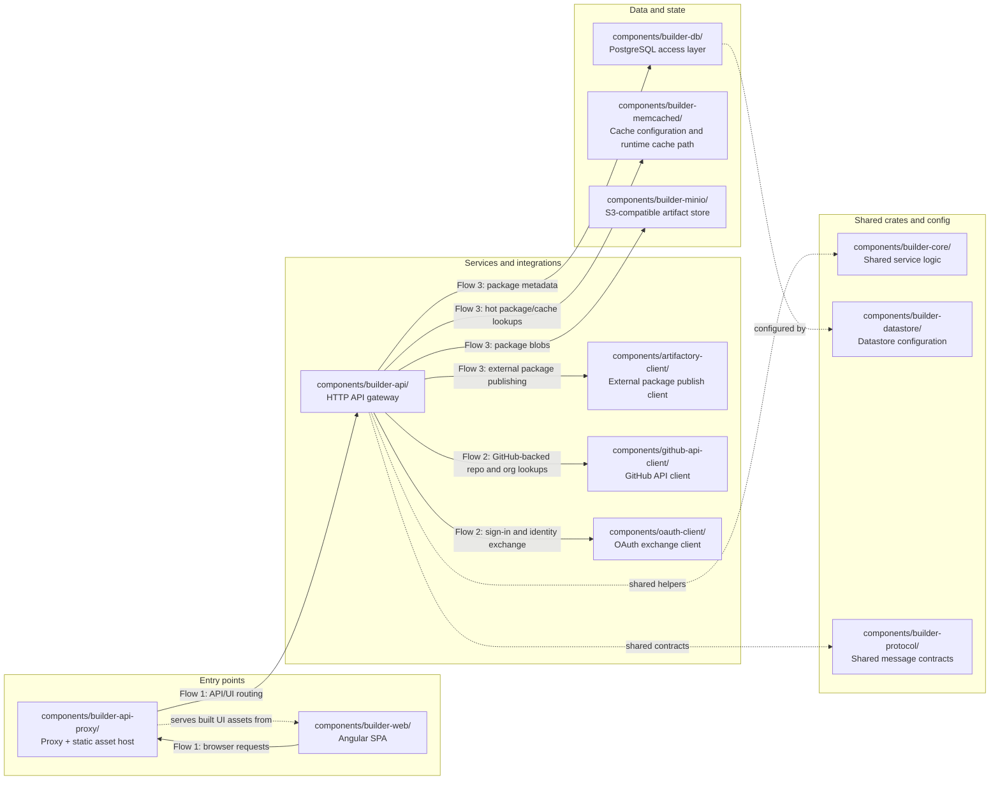

# Builder repository architecture

This diagram is generated from a checked-in architecture model. Solid arrows show request or data movement. Dashed arrows show shared code or configuration dependencies that shape how runtime pieces fit together.

## Change summary since the last documented snapshot

- Automation: this document is now generated from `support/ci/architecture-model.json` by `support/ci/generate_architecture_doc.py` and freshness-checked in CI.
- Added component coverage: `components/builder-memcached/`.
- Added flow coverage: `components/builder-api/` -> `components/builder-memcached/` (Flow 3: hot package/cache lookups).

## Diagram

## Data flows

1. **UI request flow:** `components/builder-web/` drives browser requests through `components/builder-api-proxy/`, which fronts the HTTP surface exposed by `components/builder-api/`.
2. **Authentication and GitHub flow:** `components/builder-api/` uses `components/oauth-client/` for OAuth exchanges and `components/github-api-client/` for GitHub-backed operations such as repository or organization lookups.
3. **Package storage and publishing flow:** `components/builder-api/` coordinates package metadata through `components/builder-db/`, stores package blobs through `components/builder-minio/`, uses `components/builder-memcached/` for cache-backed hot paths, and can publish outward through `components/artifactory-client/`.

## Notes

- `components/builder-core/` and `components/builder-protocol/` are shared crates used by `components/builder-api/`, so they appear as supporting dependencies rather than independent network hops.
- `components/builder-datastore/` is shown as the configuration layer that shapes how `components/builder-db/` is wired, rather than as a separately exposed user-facing entry point.
- `components/builder-memcached/` is represented as a cache-facing dependency near the API/data plane so the diagram reflects cache-backed lookup paths that were absent from the prior snapshot.
