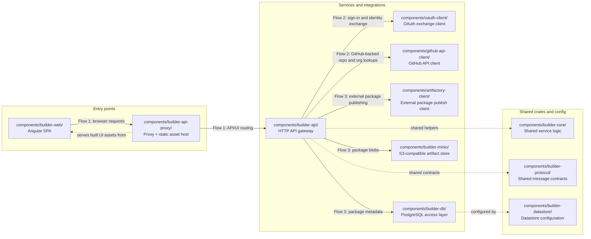

# Builder repository architecture

This diagram maps Builder's main runtime and support components to their real paths in this
repository. Solid arrows show request or data movement. Dashed arrows show shared code or config
dependencies that shape how the runtime pieces fit together.

## Data flows

1. **UI request flow:** `components/builder-web/` drives browser requests through
   `components/builder-api-proxy/`, which fronts the HTTP surface exposed by
   `components/builder-api/`.
2. **Authentication and GitHub flow:** `components/builder-api/` uses `components/oauth-client/`
   for OAuth exchanges and `components/github-api-client/` for GitHub-backed operations such as
   repository or organization lookups.
3. **Package storage and publishing flow:** `components/builder-api/` coordinates package metadata
   through `components/builder-db/`, stores package blobs through the S3-compatible path represented
   by `components/builder-minio/`, and can publish outward through
   `components/artifactory-client/`.

## Notes

- `components/builder-core/` and `components/builder-protocol/` are shared crates used by
  `components/builder-api/`, so they appear as supporting dependencies rather than independent
  network hops.
- `components/builder-datastore/` is shown as the configuration layer that shapes how
  `components/builder-db/` is wired, rather than as a separately exposed user-facing entry point.
